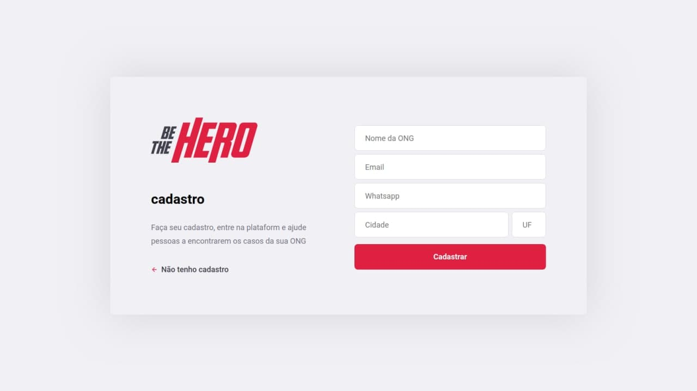
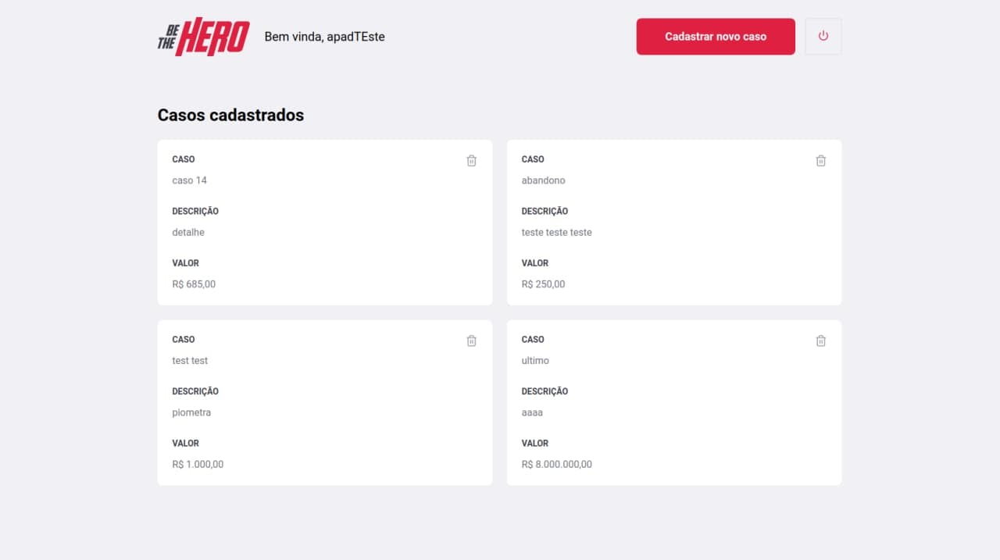
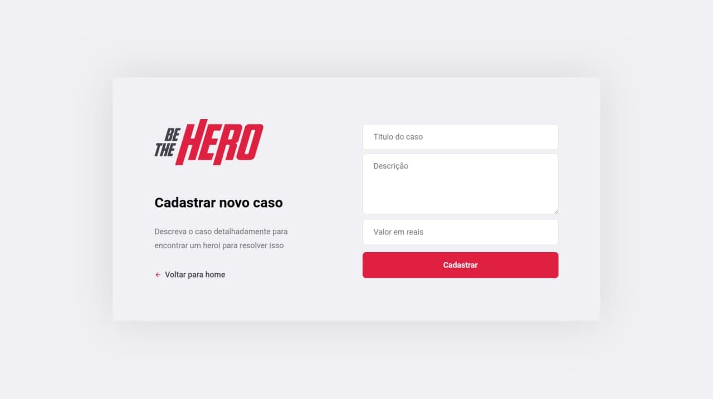

<h1 align="center">Be the hero!</h1>

Aplicação React/React Native para efetuar doações a animaizinhos carentes através de ongs.

<h1 align="center">
  
</h1>

<h1 align="center">
  
</h1>

<h1 align="center">
  
</h1>

<h1 align="center">
  
</h1>
